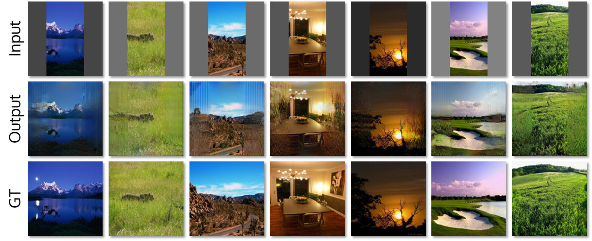
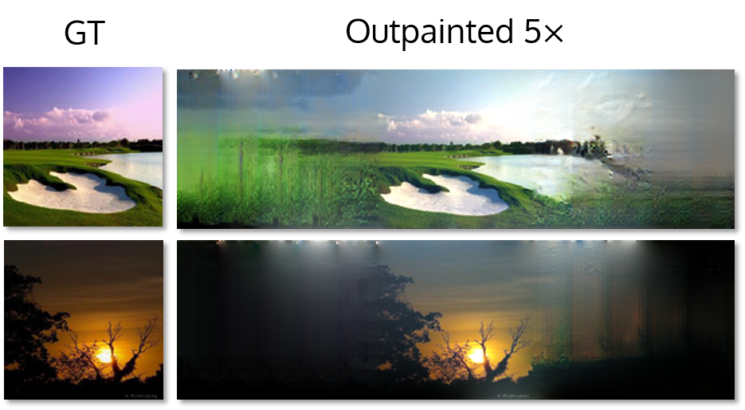

# Painting Outside the Box: Image Outpainting with GANs

We designed and implemented a pipeline for **image outpainting** for our final project for Stanford's CS 230 (Deep Learning) in Spring 2018.


## Quick Links

* Paper: [http://cs230.stanford.edu/projects_spring_2018/reports/8290490.pdf](http://cs230.stanford.edu/projects_spring_2018/reports/8290490.pdf)
* Poster: [http://cs230.stanford.edu/projects_spring_2018/posters/8265861.pdf](http://cs230.stanford.edu/projects_spring_2018/posters/8265861.pdf)
* Training animation: [http://marksabini.com/cs230-outpainting](http://marksabini.com/cs230-outpainting)

## Environment Setup

These instructions assume that the current working directory `[cwd]` is `[repo]/src`. We no longer have access to our specific instances, so we unfortunately cannot help with system-specific troubleshooting. However, the instructions below are to the best of our memory, and should be *very close* to what is needed:

* If desired, use an AWS instance. We used `p2.xlarge`, and the CS 230 website has a good setup guide here: https://cs230-stanford.github.io/aws-starter-guide.html. We also recommend reserving a static IP for AWS instances to make `ssh` and `scp` easier.


* Install the necessary dependencies. The main ones are TensorFlow , OpenCV, NumPy, SciPy, and PIL.

* Clone the repo: `>> git clone https://github.com/ShinyCode/image-outpainting.git`

* Download the [raw dataset](http://data.csail.mit.edu/places/places365/val_256.tar) from the Places365 website to `[cwd]/raw`. From the Python shell, run the following to resize the data and load it into an `.npy` file:

  ```
  >> import util
  >> IN_PATH, RSZ_PATH, OUT_PATH = 'raw', 'places_resized', 'places/all_images.npy'
  >> util.resize_images(IN_PATH, RSZ_PATH)
  >> util.compile_images(RSZ_PATH, OUT_PATH)
  ```

* Before the data can be used for training, it needs to be separated into training and validation splits. There isn't a function to do this, but the code below should be close to what is needed:

  ```python
  >> import numpy as np
  >> data = np.load('places/all_images.npy')
  >> idx_test = np.random.choice(36500, 100, replace=False)
  >> idx_train = list(set(range(36500)) - set(test_indices))
  >> imgs_train = data[idx_train]
  >> imgs_test = data[idx_test]
  >> np.savez('places/places_128.npz', imgs_train, imgs_test, idx_train, idx_test)
  ```

  Strictly speaking, saving the indices (`idx_train`, `idx_test`) isn't necessary, but it will help later to correlate results with the original images.

## Training the Model

* Create the folder `[cwd]/output`. Whenever you start a new run, *this folder should be empty*. Otherwise, the code will abort to avoid clobbering a previous run. To avoid this, simply rename the directory containing your previous run:
  `>> mv [cwd]/output [cwd]/someOtherName`
* If running the code for long periods of time, it's recommended to use **tmux** or **screen**. 
* Change any hyperparameters at the top of `train.py`, although it is recommended to leave the file paths alone.
* Run the code as follows: `>> ./run.sh`. This wraps the Python code and saves the console output to `[cwd]/output/out`.
* The code can be interrupted if needed, but it is recommended to allow it to finish, as it:
  * Saves results on the test set every `INTV_PRINT` iterations to `[cwd]/output/`.
  * Saves the model every `INTV_SAVE` iterations to `[cwd]/output/models/`.
  * Saves the loss every `INTV_SAVE` iterations to `[cwd]/output/loss.npz`.
  * Performs postprocessing on the final batch of test images and saves the results.

## Using the Model

* Training can be restarted from a checkpoint by running `>> python train.py [ITER]`, where `ITER` corresponds to the iteration associated with the desired model checkpoint.
* The file `[cwd]/gen.py` performs image outpainting and expands the size of the input image. Once you have a model, you can run `gen.py` from the terminal by invoking: 
  `>> python gen.py [model_PATH] [in_PATH] [out_PATH]`
  Here, `model_PATH` is the path to the model, `in_PATH` is the path to the input image, and `out_PATH` is the path where the output image will be saved.
* The file `[cwd]/test.py` is slightly different from `gen.py`, since it first crops the image and then performs image outpainting, so that the output image size is the same as the input image size. This is useful for computing metrics, as the input image functions as the ground truth. It is invoked analogously to `gen.py`:
  `>> python test.py [model_PATH][in_PATH] [out_PATH]`

## Gallery

Here are some of our results, taken directly from our poster!

### Main Results



### Recursive Outpainting


